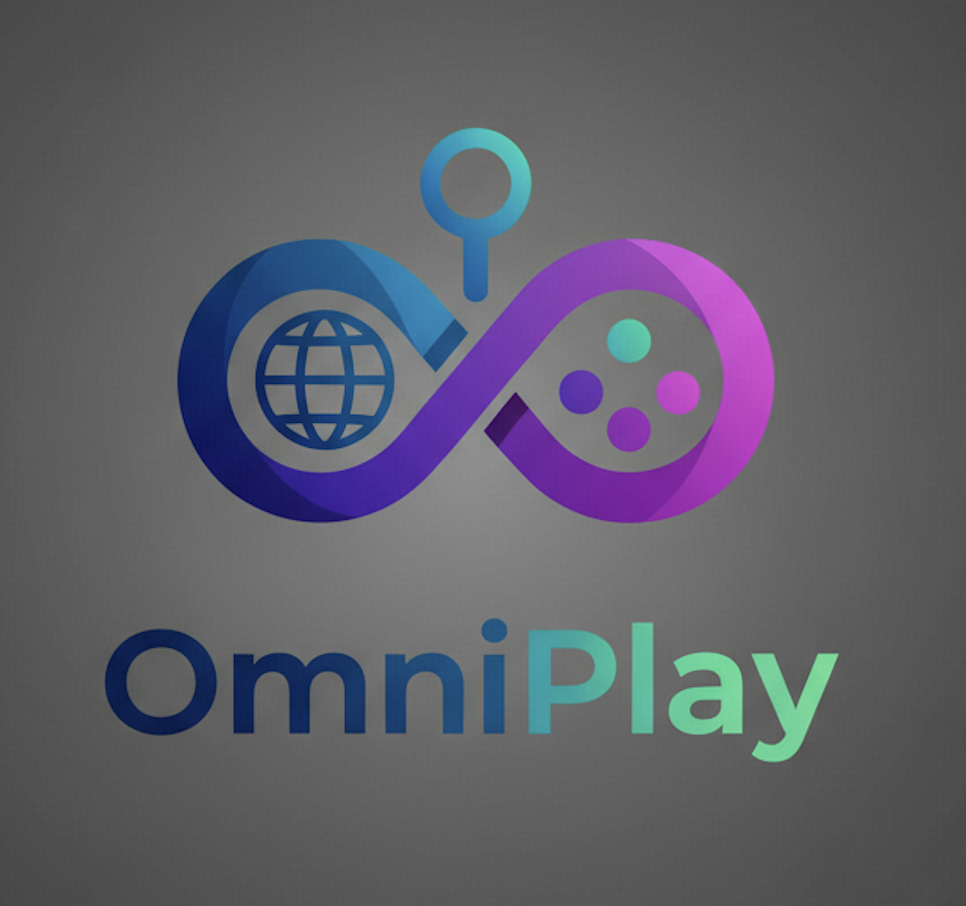
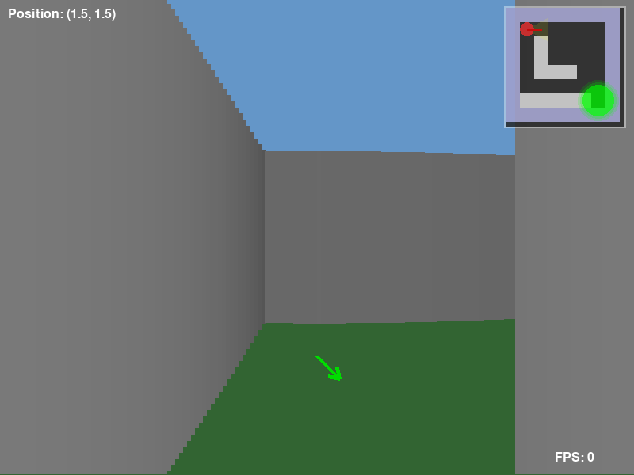
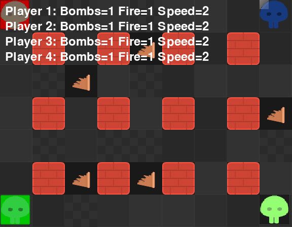
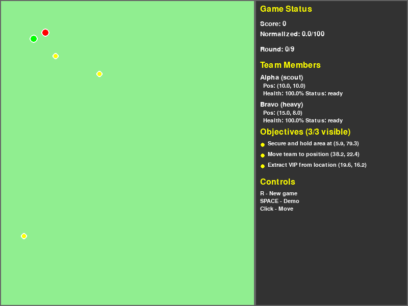

<p align="center">
  
</p>

<h1 align="center">🎮 OmniPlay Benchmark</h1>

<p align="center">
  <b>The First Diagnostic Benchmark for Omni-Modal Agentic Reasoning</b>
</p>

<p align="center">
  <a href="https://arxiv.org/abs/2508.04361"></a>
  <a href="#-leaderboard"></a>
  <a href="LICENSE"></a>
</p>

<p align="center">
  
  
  
  
</p>

<p align="center">
  <a href="#-demo-showcase">Demo</a> •
  <a href="#-quick-start">Quick Start</a> •
  <a href="#-games">Games</a> •
  <a href="#-unified-framework">Framework</a> •
  <a href="#-leaderboard">Leaderboard</a> •
  <a href="#-citation">Citation</a>
</p>

---

## 🎬 Demo Showcase

<p align="center">
  <i>Watch AI models navigate, strategize, and reason across multiple modalities in real-time</i>
</p>

<table align="center">
  <tr>
    <td align="center" width="50%">
      
      <br/>
      <b>🔊 Whispered Pathfinding</b>
      <br/>
      <i>3D maze navigation via voice guidance</i>
    </td>
    <td align="center" width="50%">
      
      <br/>
      <b>💣 Blasting Showdown</b>
      <br/>
      <i>Multi-agent Bomberman battles</i>
    </td>
  </tr>
  <tr>
    <td align="center" width="50%">
      
      <br/>
      <b>🎵 Myriad Echoes</b>
      <br/>
      <i>Audiovisual sequence memory</i>
    </td>
    <td align="center" width="50%">
      
      <br/>
      <b>👻 Phantom Soldiers</b>
      <br/>
      <i>Tactical fog-of-war command</i>
    </td>
  </tr>
</table>

---

## 📖 Overview

**OmniPlay** is the first comprehensive benchmark for evaluating omni-modal AI models through interactive game environments. We test how well models can process **🎬 Video**, **🔊 Audio**, **🖼️ Image**, and **📝 Text** simultaneously in dynamic scenarios — not just understand them in isolation, but **reason across all modalities to take actions**.

<p align="center">
  <table>
    <tr>
      <td align="center">🎮<br/><b>5 Games</b></td>
      <td align="center">🎥<br/><b>Video Input</b></td>
      <td align="center">🔊<br/><b>Audio Input</b></td>
      <td align="center">🧠<br/><b>Agentic Reasoning</b></td>
      <td align="center">📊<br/><b>Human Baseline</b></td>
    </tr>
  </table>
</p>

### Why OmniPlay?

| Feature | Description |
|:--------|:------------|
| 🎮 **Interactive** | Models must take actions in real-time game environments, not just answer questions |
| 🌐 **Truly Omni-Modal** | Tests video, audio, image, and text understanding **together** |
| 🧠 **Agentic Reasoning** | Games demand cross-modal reasoning, planning, and decision-making |
| 🎯 **Diagnostic** | Reveals specific capability gaps through diverse task types |
| 📈 **Comparable** | Standardized metrics with human expert baselines |

### ✨ Key Findings

> 🔬 **Capability Schism**: Current omni-modal models show severe performance gaps across tasks. Gemini 2.5 Pro achieves **97.5%** on audio navigation but only **28.4%** on audio-visual learning — a **3.4x** difference!

---

## 🎮 Games

| Game | Modalities | Task | Key Skills Evaluated |
|:-----|:-----------|:-----|:---------------------|
| **🧪 The Alchemist's Melody** | 🖼️ Image + 🔊 Audio + 📝 State | Learn color-note mappings to reproduce sequences | Audio-visual association, pattern learning |
| **🎵 Myriad Echoes** | 🎬 Video + 🔊 Audio + 🖼️ Image | Observe and reproduce audiovisual sequences | Sequence memory, coordinate prediction |
| **💣 Blasting Showdown** | 🖼️ Image + 🔊 Audio + 📝 State | Multi-agent Bomberman battles | Strategic planning, real-time decision |
| **👻 Phantom Soldiers** | 🎬 Video + 🔊 Audio + 📝 Vector | Command units to discover hidden targets | Tactical reasoning, spatial awareness |
| **🔊 Whispered Pathfinding** | 🖼️ Image + 🔊 Audio + 📝 Vector | Navigate maze using voice guidance | Audio comprehension, spatial navigation |

<details>
<summary><b>📌 Click to expand game details</b></summary>

### 🧪 The Alchemist's Melody
A sound-based puzzle game where AI must learn the hidden mapping between colors and musical notes, then reproduce increasingly complex sequences.
- **Difficulty Levels**: Easy (4 elements) / Normal (6 elements) / Hard (8 elements)
- **Metrics**: Accuracy, Steps to Complete, Learning Curve
- **Scripts**: `run_mm_agent.py`, `multimodal_agent_baichuan.py`

### 🎵 Myriad Echoes  
A rhythm memory game requiring observation of icon-sound sequences followed by accurate reproduction.
- **Difficulty Levels**: Level 1-3 (6-15 icons)
- **Metrics**: Sequence Accuracy, Coordinate Precision, Success Rate
- **Scripts**: `eval_openai_multi_episode.py`, `eval_baichuan_multi_episode.py`

### 💣 Blasting Showdown
Bomberman-style multi-agent competitive game where AI models battle against each other.
- **Features**: Real-time strategy, Multi-AI interaction, Gymnasium environment
- **Metrics**: Kill Count, Survival Rate, Win Rate, Strategy Score
- **Scripts**: `multi_model_game.py`, `start_ai_game.py`

### 👻 Phantom Soldiers in the Fog
A tactical command game where AI directs hidden units to complete objectives under fog of war.
- **Difficulty Levels**: Normal / Medium / Hard
- **Metrics**: Normalized Score, Objective Completion, Command Compliance
- **Scripts**: `eval-openai-multi-episode.py`, `eval-baichuan-multi-episode.py`

### 🔊 Whispered Pathfinding
A 3D maze navigation game where AI follows voice-based directional guidance to reach the goal.
- **Difficulty Levels**: Easy / Medium / Hard (maze complexity)
- **Metrics**: Success Rate, Path Efficiency, Step Count
- **Scripts**: `test_openai.py`, `test_baichuan.py`

</details>

---

## ⚡ Quick Start

### Installation

```bash
# Clone the repository
git clone https://github.com/fuqingbie/omni-game-benchmark.git
cd omni-game-benchmark

# Install core dependencies
pip install pygame numpy pillow requests gymnasium opencv-python

# Install audio/video processing (required for some games)
pip install moviepy librosa soundfile
```

### Configure API Keys

```bash
# Set environment variables
export OPENAI_API_KEY="your-openai-key"
export BAICHUAN_API_KEY="your-baichuan-key"      # Optional
export DASHSCOPE_API_KEY="your-qwen-key"         # Optional
```

### Run Evaluation

#### Option 1: Unified Framework (Recommended) 🚀

```bash
# Run single game with specific model
python eval/game/run_benchmark.py --game alchemist_melody --model gpt-4o --episodes 10

# Run multiple games with config file
python eval/game/run_benchmark.py --config eval/game/benchmark_config.yaml

# List available games and models
python eval/game/run_benchmark.py --list-games
python eval/game/run_benchmark.py --list-models
```

#### Option 2: Individual Game Scripts

```bash
# The Alchemist's Melody
cd eval/game/The_Alchemist-s_Melody && python run_mm_agent.py --episodes 10

# Myriad Echoes
cd eval/game/Myriad_Echoes && python eval_openai_multi_episode.py --num_episodes 10

# Blasting Showdown
cd eval/game/Blasting_Showdown && python multi_model_game.py --config model_config.json

# Phantom Soldiers in the Fog
cd eval/game/Phantom_Soldiers_in_the_Fog && python eval-openai-multi-episode.py --num_episodes 10

# Whispered Pathfinding
cd eval/game/Whispered_Pathfinding && python test_openai.py --difficulty medium --rounds 5
```

---

## 🔧 Unified Framework

OmniPlay provides a unified evaluation framework in `eval/game/common/` for consistent benchmarking.

### Architecture

```
eval/game/
├── common/                      # 🔧 Unified Framework
│   ├── model_registry.py        # Model capability management
│   ├── video_processor.py       # Video/frame processing modes
│   ├── result_schema.py         # Standardized result format
│   ├── game_registry.py         # Game registration & discovery
│   ├── runner.py                # Batch evaluation runner
│   └── statistics.py            # Metrics & analysis
├── run_benchmark.py             # 🚀 Single entry point
└── benchmark_config.yaml        # Configuration template
```

### Evaluated Models

| Provider | Model | Video | Audio | Leaderboard Rank |
|:---------|:------|:-----:|:-----:|:----------------:|
| **Google** | Gemini 2.5 Pro | ✅ | ✅ | 🥇 1st |
| **Google** | Gemini 2.5 Flash | ✅ | ✅ | 🥈 2nd |
| **Baichuan** | Baichuan-Omni-1.5 | ✅ | ✅ | 🥉 3rd |
| **OpenBMB** | MiniCPM-o-2.6 | ✅ | ✅ | 4th |
| **Open** | VITA-1.5 | ✅ | ✅ | 5th |
| **Alibaba** | Qwen-2.5-Omni | ✅ | ✅ | 6th |

### Adding Custom Models

```python
from eval.game.common import get_default_registry

registry = get_default_registry()
registry.register(
    name="my-custom-model",
    api_base="https://api.example.com/v1",
    capability_preset="openai",  # or "baichuan", "qwen", "gemini"
)
```

---

## 🏆 Leaderboard

> **Last Updated**: October 2025 | [Full Leaderboard →](docs/LEADERBOARD.md)

### 📊 Capability Schism Visualization

<p align="center">
  
</p>

<p align="center">
  <i>The radar chart reveals a striking "Capability Schism" — models excel at audio navigation but struggle with complex multimodal reasoning tasks like tactical command and audio-visual learning.</i>
</p>

### 🥇 Overall Ranking

| Rank | Model | Whispered | Echoes | Phantom | Alchemist | Blasting |
|:----:|:------|:---------:|:------:|:-------:|:---------:|:--------:|
| Ref | **Human Expert** | 100.0 | 100.0 | 100.0 | 100.0 | - |
| 🥇 | **Gemini 2.5 Pro** | 97.5 | 223.4 | 83.2 | 28.4 | 36.11% |
| 🥈 | **Gemini 2.5 Flash** | 95.5 | 23.7 | 49.1 | 10.5 | 28.95% |
| 🥉 | **Baichuan-Omni-1.5** | 88.7 | -2.3 | -3.5 | 10.2 | 17.65% |
| 4 | MiniCPM-o-2.6 | 86.4 | -1.3 | -30.7 | 7.7 | 19.35% |
| 5 | VITA-1.5 | 81.9 | -3.6 | -52.2 | -8.9 | 7.41% |
| 6 | Qwen-2.5-Omni | 73.6 | -2.7 | -7.8 | 9.2 | 11.76% |

> 📊 *Scores normalized to Human Expert (100.0). Negative = below random baseline. Blasting uses Win Rate %.*

### 🏅 Per-Game Champions

| Game | Best Model | Score | Insight |
|:-----|:-----------|:-----:|:--------|
| 🔊 Whispered Pathfinding | Gemini 2.5 Pro | 97.5 | Near human-level audio navigation |
| 🎵 Myriad Echoes | Gemini 2.5 Pro | 223.4 | Exceeds human performance |
| 👻 Phantom Soldiers | Gemini 2.5 Pro | 83.2 | Best tactical reasoning |
| 🧪 Alchemist's Melody | Gemini 2.5 Pro | 28.4 | Audio-visual learning is hard |
| 💣 Blasting Showdown | Gemini 2.5 Pro | 36.11% | Highest win rate |

---

## 📊 Evaluation Metrics

### Universal Metrics

| Metric | Description | Formula |
|:-------|:------------|:--------|
| **Success Rate** | Task completion percentage | `completed / total × 100` |
| **Efficiency** | Steps relative to optimal | `optimal_steps / actual_steps × 100` |
| **Accuracy** | Action/prediction precision | Game-specific |
| **Adaptability** | Cross-difficulty consistency | `std(scores) / mean(scores)` |
| **Multimodal Score** | Modality utilization effectiveness | Weighted combination |

### Overall Score Calculation

$$\text{Score}_{\text{overall}} = \sum_{g \in \text{Games}} w_g \cdot \text{normalize}(\text{metrics}_g)$$

Where weights $w_g$ are based on game complexity and modality diversity.

---

## 📁 Project Structure

```
omni-game-benchmark/
├── eval/game/
│   ├── common/                      # 🔧 Unified framework
│   │   ├── model_registry.py        # Model capabilities
│   │   ├── video_processor.py       # Video processing
│   │   ├── result_schema.py         # Result format
│   │   ├── game_registry.py         # Game registry
│   │   ├── runner.py                # Evaluation runner
│   │   └── statistics.py            # Statistics
│   ├── Blasting_Showdown/           # 💣 Bomberman game
│   ├── The_Alchemist-s_Melody/      # 🧪 Sound puzzle
│   ├── Myriad_Echoes/               # 🎵 Rhythm memory
│   ├── Phantom_Soldiers_in_the_Fog/ # 👻 Tactical command
│   ├── Whispered_Pathfinding/       # 🔊 Audio navigation
│   ├── assets-necessay/             # Shared assets
│   ├── run_benchmark.py             # 🚀 Entry point
│   └── benchmark_config.yaml        # Config template
├── docs/
│   ├── LEADERBOARD.md               # Full leaderboard
│   └── assets/                      # Documentation assets
├── requirements.txt
├── CONTRIBUTING.md
├── LICENSE
└── README.md
```

---

## ⚠️ Important Notes

| Item | Recommendation |
|:-----|:---------------|
| **Python Version** | 3.8+ required |
| **RAM** | 8GB+ recommended |
| **GPU** | Optional, speeds up video processing |
| **API Costs** | Monitor usage, especially for video models |
| **Concurrency** | Run one game instance at a time |
| **Audio Libs** | Install `librosa`, `soundfile` for audio games |

---

## 🤝 Contributing

We welcome contributions! See [CONTRIBUTING.md](CONTRIBUTING.md) for guidelines.

### Ways to Contribute

- 🎮 **Add New Games** — Implement `BaseGameEnv` interface
- 🤖 **Add New Models** — Register in `model_registry.py`
- 📊 **Submit Results** — Run evaluations and update leaderboard
- 🐛 **Report Issues** — Open GitHub issues
- 📖 **Improve Docs** — Enhance documentation

---

## 📄 License

This project is licensed under the MIT License - see [LICENSE](LICENSE) for details.

---

## 📖 Citation

If you use OmniPlay in your research, please cite our paper:

```bibtex
@misc{bie2025omniplaybenchmarkingomnimodalmodels,
      title={OmniPlay: Benchmarking Omni-Modal Models on Omni-Modal Game Playing}, 
      author={Fuqing Bie and Shiyu Huang and Xijia Tao and Zhiqin Fang and Leyi Pan and Junzhe Chen and Min Ren and Liuyu Xiang and Zhaofeng He},
      year={2025},
      eprint={2508.04361},
      archivePrefix={arXiv},
      primaryClass={cs.AI},
      url={https://arxiv.org/abs/2508.04361}, 
}
```

---

<p align="center">
  <b>Made with ❤️ by the OmniPlay Team</b>
  <br>
  <a href="https://github.com/fuqingbie/omni-game-benchmark">GitHub</a> •
  <a href="https://arxiv.org/abs/2508.04361">Paper</a>
</p>

